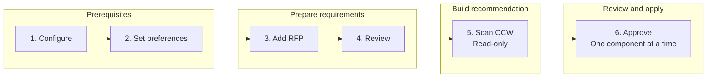

# CCW BoQ Copilot

CCW BoQ Copilot turns customer compute requirements into reviewable Cisco UCS component recommendations. It runs as a Chrome side panel with a local macOS companion.

The user stays in control: review and edit every extracted requirement, approve components individually, and complete quote submission manually in CCW.

## User journey at a glance



| Step | What you do | What CCW Copilot does |
| --- | --- | --- |
| 1. Configure | Choose an extraction provider and model, then enter the required tokens. | Connects the side panel to the local companion and prepares the selected LLM. |
| 2. Set preferences | Enter a target lead time and any optional hard constraints. | Applies your delivery target and explicit design rules to extraction and recommendation. |
| 3. Add the RFP | Paste the relevant RFP text and select **Extract requirements**. | Uses the selected LLM to convert the RFP into structured UCS requirements. |
| 4. Review | Correct extracted values and answer any clarification questions. | Revalidates your edits and keeps unresolved issues limited to the affected category. |
| 5. Scan CCW | Open the intended UCS configuration page and select **Scan and recommend**. | Reads the live CCW component catalog without changing the configuration, then creates a recommendation. |
| 6. Approve | Review each recommended SKU, quantity, placement, price, lead time, and reason. Select **Approve this component** only when it is correct. | Applies and verifies that component in CCW. It never submits the quote or places an order. |

## Prerequisites

Before starting, have the following ready:

- macOS 12 or newer
- Node.js 22 or newer
- Chrome 120 or newer
- Access to Cisco CCW and a UCS server configuration page
- The RFP text you want to process
- [Ollama](https://ollama.com/) with `qwen3.5:4b-q4_K_M` for the default local provider
- Optional Cisco-internal processing: a current CircuIT access token and an authorized application key

For first-time validation, use a disposable CCW draft rather than a customer quote.

## First-time setup

### 1. Install and build

From the project folder, run:

```bash
npm install
npm run build
```

### 2. Start the companion

```bash
npm run dev:companion
```

Keep this process running while using the extension. Copy the companion session token printed in the terminal.

The companion listens only on `127.0.0.1`. It checks for Ollama automatically and starts `ollama serve` when Ollama is installed but not already running. An independently running Ollama service is left untouched.

Authorized Cisco users can enable CircuIT without storing its application key in the repository:

```bash
CIRCUIT_APP_KEY="your-authorized-application-key" npm run dev:companion
```

### 3. Load the Chrome extension

1. Open `chrome://extensions`.
2. Enable **Developer mode**.
3. Select **Load unpacked**.
4. Choose `packages/extension/dist`.
5. Open the **CCW Copilot** side panel.

Reload the unpacked extension after every new build.

### 4. Configure Settings

Open the **Settings** tab and complete these fields:

1. **Companion session token** — paste the token printed when the companion started.
2. **Provider** — choose where the RFP is processed.
3. **Model** — choose the model used to extract requirements.
4. **CircuIT access token** — required only when CircuIT is selected.
5. Select **Save settings**.

| Provider | Model | Token and data behavior |
| --- | --- | --- |
| **Local Ollama** — default | `qwen3.5:4b-q4_K_M` is recommended for a 16 GB M1 Mac | Keeps the supplied RFP text on the Mac. The model must be installed locally; select **Refresh local models** after adding one. |
| **CircuIT (Cisco internal)** — optional | `gemini-3.1-flash-lite` or `gpt-5-nano` | Requires an authorized `CIRCUIT_APP_KEY` when starting the companion and a current access token in the side panel. RFP text is sent to Cisco's internal AI service. The access token stays only in the open side panel. |

To install the recommended local model on another Mac:

```bash
ollama pull qwen3.5:4b-q4_K_M
```

`qwen3.5:9b-q4_K_M` can improve extraction quality but uses roughly twice the model memory and runs more slowly. `qwen3.5:2b-q4_K_M` is the fastest low-memory fallback. Embedding and coder-focused models are not recommended for requirement extraction.

### 5. Set planning preferences

Open the **Requirements** tab before extracting the RFP.

- **Target lead time (days)** is optional. Enter `0`–`182` to require every recommended component to have a known lead time within that target. Leave it blank when delivery time should not filter the recommendation. A delivery deadline found in the RFP can also populate this value.
- **Constraints preference** contains optional hard rules for CPU socket count, DIMM count, and maximum local capacity drives per server. A value entered here overrides conflicting RFP wording. Leave a field blank to follow the RFP.

The local-drive limit preserves empty bays and does not include boot drives.

## Complete usage walkthrough

### Step 1 — Input the RFP

On the **Requirements** tab, paste the relevant RFP content into **Paste RFP text**.

Pasted text is the standard and recommended intake path. File upload for PDF, DOCX, XLSX, and TXT is an optional beta feature. Enable it under **Settings > Beta features** only when needed, and review every value it extracts. Legacy `.xls` files must first be saved as `.xlsx`.

### Step 2 — Extract requirements with the LLM

Select **Extract requirements**.

CCW Copilot sends the complete input to the provider and model selected in Settings. The LLM identifies CPU, memory, storage, RAID, boot, GPU, NIC, server, and delivery requirements. The app then normalizes units and topology, validates supported fields, and flags ambiguous or conflicting inputs.

Expected result: editable requirement cards appear below the RFP input. If extraction fails, confirm that the companion is running and that both the companion token and provider credentials are current.

### Step 3 — Review and manually edit the results

Do not treat the first extraction as final. Review every value against the source RFP.

- Correct values directly in their CPU, Memory, Storage, NIC, and other category sections.
- Add or remove storage and NIC groups when the RFP describes more than one design.
- Check the displayed source evidence so each value can be traced back to the RFP.
- Answer clarification questions when the RFP is materially ambiguous.
- Confirm that quantities describe the intended topology. For example, two quad-port NICs means two cards with four ports per card.

Only the unresolved category or group waits for clarification. Valid categories can still produce recommendations.

### Step 4 — Open the UCS configuration page in CCW

Sign in to CCW and open the exact UCS server draft you want to configure. Keep that configuration page active, then return to the CCW Copilot side panel and open the **CCW** tab.

The open model matters: recommendations are based on the component categories and options available in that live UCS configuration.

### Step 5 — Scan and recommend

Select **Scan and recommend**, then grant access only to the displayed Cisco origin if Chrome asks.

The scan is read-only. CCW Copilot visits supported configuration categories, reads current SKUs, prices, availability, lead times, slot locations, and existing selections, and returns to the category where the scan began. It then builds the lowest-list-price compatible recommendation that satisfies the reviewed requirements and lead-time target.

Review the result before approving anything. Each recommendation shows:

- Component type and physical CCW category or slot
- SKU and product description
- Required quantity
- Unit contribution to list price
- Lead time
- The reason it was selected
- Validation or clarification messages

If CCW content, model, prices, availability, or existing selections have changed, run **Scan and recommend** again.

### Step 6 — Approve components

For each recommendation:

1. Compare the SKU, description, quantity, placement, price, and lead time with the RFP and your design intent.
2. Select **Approve this component**.
3. Wait for the success or error message before continuing.
4. Confirm the updated selection in CCW.

Approval is component-by-component. Before and after each action, the extension verifies that the live page still matches the scanned draft and that CCW accepted the expected quantity. It does not approve unresolved recommendations, submit the quote, or place an order.

## Reusing a scan

Every successful scan is stored privately in Chrome for the detected UCS parent SKU.

- Use **Recommend only** after editing requirements or preferences when the open CCW configuration and its catalog have not changed.
- Use **Scan and recommend** after changing the UCS model or configuration, or whenever price, availability, lead time, or page content may have changed.
- A recommendation made from a stored catalog is read-only. Approval becomes available only after the matching live CCW draft is scanned again.
- Saved catalogs can be reviewed and selected under **Settings > Scanned CCW catalogs**.

## Safety checklist

Before approving a component, confirm that:

- The correct CCW draft and UCS parent SKU are open.
- Every extracted requirement has been reviewed.
- All material clarifications have been answered.
- The recommendation uses the intended quantity and physical slot or category.
- Price and lead time are visible and acceptable.
- Final CCW validation covers power, cables, cooling, firmware/HCL, licenses, chassis, and fabric dependencies.

CCW remains the authority whenever it reports a conflict. The output is a component recommendation, not a complete orderable BOM.

---

## Detailed behavior and rules

The sections below describe supported behavior and implementation boundaries. New users can follow the onboarding and user journey above without reading this reference first.

### Extraction and editing

- The selected LLM processes the complete RFP first. Deterministic extraction remains available as a provider-failure fallback.
- Normalization enforces supported field IDs, units, CPU topology, NIC topology, RAID meaning, and ambiguity handling.
- Source evidence can reference a PDF page, DOCX paragraph, spreadsheet range, or pasted text.
- CPU sockets, total cores, and cores per socket can independently constrain a recommendation.
- Memory capacity, DIMM count, and DIMM size can independently constrain a recommendation. Memory is normalized to GB using `1 TB = 1024 GB`.
- Drive-group capacity and an explicit drive population can both be used. Missing categories are skipped instead of blocking categories that are ready.
- Conflicting server profiles and material ambiguity require clarification rather than a silent assumption.

### Lead time and ranking

- The delivery target is evaluated against the slowest selected component.
- Components with unknown lead time are not considered compliant when a target is set.
- Lowest complete list price is considered only after compatibility, requirements, placement, and lead-time rules pass.
- Options without a numeric CCW price are excluded rather than treated as free.

### Recommendation coverage

- Recommendations cover CPU, memory, standard RAID controllers, no-RAID HBA pass-through, front-facing local storage, PCIe MLOM, riser NICs, M.2 boot controllers, M.2 drives, and applicable GPUs.
- CPU, memory, raw/RAID storage, GPU, NIC port and throughput, PCIe, C-Series, and X-Series foundation constraints are applied before price ranking.
- Explicit per-server CPU socket counts override provider inference.
- C2xx rack servers and X21x compute nodes are limited to 32 DIMM slots by the current structural rules.
- Each recommendation includes its SKU, description, quantity, physical category or slot, list-price contribution, reason, and lead time.

### Storage and boot rules

- Capacity is evaluated independently for each drive group.
- Explicit `raw` or `usable` wording wins. Aggregate capacity plus RAID defaults to usable; drive count plus capacity per drive defaults to raw.
- Usable capacity without a RAID level requires clarification.
- RAID 1 uses exactly two identical drives. RAID 1, 5, 6, and 10 overhead is included when calculating usable capacity.
- A single M.2 boot drive is treated as non-mirrored/JBOD. The default mirrored boot layout is two identical M.2 drives in RAID 1.
- M.2 boot drives use the M.2 controller. Non-M.2 RAID storage uses a compatible standard controller. No-RAID and U.2 pass-through storage use the HBA path.
- Capacity drives are recommended only in scanned front-facing bays, never rear-riser or midplane bays.
- Local-storage results show the raw-to-usable calculation, drive quantity, and placement.

### NIC and PCIe placement rules

- Explicit topology is preserved: card count, ports per card, speed per port, and media are separate constraints.
- SFP, QSFP, RJ45, BASE-T, BASET, UTP, FC, and Fibre Channel wording is recognized.
- FC HBA groups use riser slots first. Requirements that explicitly request VIC or OCP use PCIe MLOM.
- Other Ethernet groups use compatible riser slots first and fall back to PCIe MLOM only when needed.
- Eligible riser choices prefer lower physical PCIe slot numbers and reject known model-specific incompatible mixes.
- Existing scanned CPU, memory, and occupied PCIe selections participate in compatibility checks.

### Supported CCW discovery

The rack-server adapter reads supported processor, memory, standard RAID/HBA, front- and rear-facing storage, PCIe MLOM/OCP, riser-slot, and M.2 boot/drive categories. Slot-specific navigation is retained so the same SKU in different slots is not treated as one option.

Automatic M8 rack profile inference currently recognizes C220/C225 as C22x 1RU and C240/C245 as C24x 2RU. A model suffix of `0` maps to Intel and `5` maps to AMD. Riser slots are discovered from the live page rather than assumed from form factor.

A generic visible-row adapter remains as a fallback. Different generations, localized currencies, and modal workflows require validation against a disposable authenticated draft.

### Security boundaries

- Extension access is requested at runtime only for the active Cisco origin.
- The companion binds only to `127.0.0.1` and requires a random session bearer token.
- The extension does not read Cisco cookies or passwords.
- CircuIT credentials are supplied at runtime, held in memory only, sent through the local companion for the selected request, and never written to Chrome storage or the project.
- Local Ollama keeps supplied RFP text on the Mac. CircuIT sends it to Cisco's internal AI service.
- Scanning does not select components. Approval requires an explicit user action for each component.
- Quote submission and ordering always remain manual.

### Current rule gaps

The included platform limits are safe structural defaults, not a complete Cisco product catalog. Production use still requires model- and generation-specific validation for CPU/socket compatibility, DIMM population and performance, exact RAID/controller support, boot constraints, GPU thermal/power/riser combinations, VIC/riser/slot mappings, X-Series node/chassis/fabric topology, licensing, PSU redundancy, and regional CCW behavior.

## Developer reference

### Validate and build

```bash
npm run typecheck
npm test
npm run lint
npm run build
```

### Code layout

- `packages/extension/src/sidepanel.ts` coordinates the Chrome side panel. Catalog presentation, provider settings, and scan progress live in focused sibling modules.
- `packages/shared/src/optimizer.ts` assembles rack recommendations. Clarification policy and generic candidate ranking are separated into `clarifications.ts` and `candidate-ranking.ts`.
- `packages/companion/src/providers.ts` calls the selected provider and normalizes extracted requirements. CircuIT token and model validation live in `circuit-auth.ts`.
- `tests/` mirrors these modules and protects behavior before changes reach live CCW validation.

### Test-data boundary

The benchmark catalogs are development snapshots containing component rows only. They contain no customer identity, RFP, quote, deal, cookie, token, or discount data. Treat their prices, availability, and lead times as test inputs—not as current commercial guidance—and never replace them with an unsanitized customer or CCW capture.

### Safe adapter development

1. Use a disposable authenticated CCW draft.
2. Run **Scan and recommend** and review detected SKUs, prices, availability, and messages.
3. If priced options are missing or mislabeled, do not approve actions.
4. Use `fixtures/ccw-sanitized.html` as the development baseline.
5. Capture only sanitized DOM structure—never cookies, tokens, customer names, deal identifiers, or discounts.
6. Update `packages/extension/src/content.ts`, add a sanitized fixture, run the validation suite, rebuild, and reload the extension before retrying live.

The generic CCW adapter is not production-ready until it has been tested against the relevant authenticated CCW draft.
