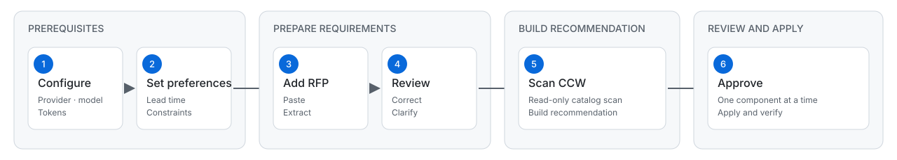

# CCW BoQ Copilot

CCW BoQ Copilot turns customer compute requirements into reviewable Cisco UCS component recommendations. It runs as a Chrome side panel with a local macOS companion.

The user stays in control: review and edit every extracted requirement, approve components individually, and complete quote submission manually in CCW.

## User journey at a glance

[](docs/user-journey.svg)

| Step | What you do | What CCW Copilot does |
| --- | --- | --- |
| 1. Configure | Choose an extraction provider and model, then enter the required tokens. | Connects the side panel to the local companion and prepares the selected LLM. |
| 2. Set preferences | Enter a target lead time and any optional hard constraints. | Applies your delivery target and explicit design rules to extraction and recommendation. |
| 3. Add the RFP | Paste the relevant RFP text and select **Extract requirements**. | Uses the selected LLM to convert the RFP into structured UCS requirements. |
| 4. Review | Correct extracted values and answer any clarification questions. | Revalidates your edits and keeps unresolved issues limited to the affected category. |
| 5. Scan CCW | Open the intended UCS configuration page and select **Scan and recommend**. | Reads the live CCW component catalog without changing the configuration, then creates a recommendation. |
| 6. Approve | Review each recommended SKU, quantity, placement, price, lead time, and reason. Select **Approve this component** only when it is correct. | Applies and verifies that component in CCW. It never submits the quote or places an order. |

## Prerequisites

Before starting, have the following ready:

- macOS 12 or newer
- Node.js 22 or newer
- Chrome 120 or newer
- Access to Cisco CCW and a UCS server configuration page
- The RFP text you want to process
- [Ollama](https://ollama.com/) with `qwen3.5:4b-q4_K_M` for the default local provider
- Optional Cisco-internal processing: a current CircuIT access token and an authorized application key

For first-time validation, use a disposable CCW draft rather than a customer quote.

## First-time setup

### 1. Install and build

From the project folder, run:

```bash
npm install
npm run build
```

### 2. Start the companion

```bash
npm run dev:companion
```

Keep this process running while using the extension. Copy the companion session token printed in the terminal.

The companion listens only on `127.0.0.1`. It checks for Ollama automatically and starts `ollama serve` when Ollama is installed but not already running. An independently running Ollama service is left untouched.

Authorized Cisco users can enable CircuIT without storing its application key in the repository:

```bash
CIRCUIT_APP_KEY="your-authorized-application-key" npm run dev:companion
```

### 3. Load the Chrome extension

1. Open `chrome://extensions`.
2. Enable **Developer mode**.
3. Select **Load unpacked**.
4. Choose `packages/extension/dist`.
5. Open the **CCW Copilot** side panel.

Reload the unpacked extension after every new build.

### 4. Configure Settings

Open the **Settings** tab and complete these fields:

1. **Companion session token** — paste the token printed when the companion started.
2. **Provider** — choose where the RFP is processed.
3. **Model** — choose the model used to extract requirements.
4. **CircuIT access token** — required only when CircuIT is selected.
5. Select **Save settings**.

| Provider | Model | Token and data behavior |
| --- | --- | --- |
| **Local Ollama** — default | `qwen3.5:4b-q4_K_M` is recommended for a 16 GB M1 Mac | Keeps the supplied RFP text on the Mac. The model must be installed locally; select **Refresh local models** after adding one. |
| **CircuIT (Cisco internal)** — optional | `gemini-3.1-flash-lite` or `gpt-5-nano` | Requires an authorized `CIRCUIT_APP_KEY` when starting the companion and a current access token in the side panel. RFP text is sent to Cisco's internal AI service. The access token stays only in the open side panel. |

To install the recommended local model on another Mac:

```bash
ollama pull qwen3.5:4b-q4_K_M
```

`qwen3.5:9b-q4_K_M` can improve extraction quality but uses roughly twice the model memory and runs more slowly. `qwen3.5:2b-q4_K_M` is the fastest low-memory fallback. Embedding and coder-focused models are not recommended for requirement extraction.

### 5. Set planning preferences

Open the **Requirements** tab before extracting the RFP.

- **Target lead time (days)** is optional. Enter `0`–`182` to require every recommended component to have a known lead time within that target. Leave it blank when delivery time should not filter the recommendation. A delivery deadline found in the RFP can also populate this value.
- **Constraints preference** contains optional hard rules for CPU socket count, DIMM count, and maximum local capacity drives per server. A value entered here overrides conflicting RFP wording. Leave a field blank to follow the RFP.

The local-drive limit preserves empty bays and does not include boot drives.

### Example RFP input

Paste this sample into **Requirements > Paste RFP text** to validate a first extraction:

```text
CPU: 2-socket 24 core, 2.2Ghz
Memory: 1TB preferably using 64GB DDR5
Drive: 4TB SSD RAID5, 2TB U.3 NVMe RAID1, 4x 1.9TB RAID10
NIC: 2 card 2x 10G SFP and 2 card 2x 32G FC
```

## Reusing a scan

Every successful scan is stored privately in Chrome for the detected UCS parent SKU.

- Use **Recommend only** after editing requirements or preferences when the open CCW configuration and its catalog have not changed.
- Use **Scan and recommend** after changing the UCS model or configuration, or whenever price, availability, lead time, or page content may have changed.
- A recommendation made from a stored catalog is read-only. Approval becomes available only after the matching live CCW draft is scanned again.
- Saved catalogs can be reviewed and selected under **Settings > Scanned CCW catalogs**.

## Safety checklist

Before approving a component, confirm that:

- The correct CCW draft and UCS parent SKU are open.
- Every extracted requirement has been reviewed.
- All material clarifications have been answered.
- The recommendation uses the intended quantity and physical slot or category.
- Price and lead time are visible and acceptable.
- Final CCW validation covers power, cables, cooling, firmware/HCL, licenses, chassis, and fabric dependencies.

CCW remains the authority whenever it reports a conflict. The output is a component recommendation, not a complete orderable BOM.

---

For extraction, recommendation, storage, NIC, security, and known-rule details, see [Detailed behavior and rules](docs/detailed-behavior-and-rules.md).
